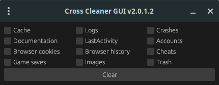

<div align="center">
<h1>🌟 Multi-cleaner GUI/CLI 🌟</h1>

### A powerful system cleanup tool written in Rust

</div>

## 📌 About the Project

**Multi-cleaner** is a high-performance tool for cleaning temporary files, cache, and other system "junk" from your computer. Built with Rust for optimal speed and reliability.

### Key Features

- 🚀 **Fast cleanup**: Leverages multi-threading for maximum performance
- 🔒 **Security system**: Carefully preserves critical system files
- 💻 **Cross-platform**: Full support for [Windows](https://github.com/paranoica/rust-multi-cleaner/blob/main/win.md) and [Linux](https://github.com/paranoica/rust-multi-cleaner/blob/main/lin.md)
- 🎯 **User-friendly**: Clean, minimalist interface for easy operation
- 📄 **Custom database**: Ability to use custom cleanup database

### Demo



## 📥 Installation

### Option 1: Download pre-built binary
Get the latest release from our [releases page](https://github.com/paranoica/rust-multi-cleaner/releases).

### Option 2: Build from source

1. Make sure you have [Rust](https://www.rust-lang.org/) installed (version 1.70 or higher):
```bash
rustc --version
```

2. Clone the repository:
```bash
git clone https://github.com/paranoica/rust-multi-cleaner.git
cd rust-multi-cleaner
```

3. Build the project:
```bash
cargo build --release
```

4. The compiled binary will be located in `./target/release`

## 📖 Additional files

- **Deep integration tests**: [Click here!](https://github.com/paranoica/rust-multi-cleaner/blob/main/tests.md)
- **Deep build parameters & etc.**: [Click here!](https://github.com/paranoica/rust-multi-cleaner/blob/main/build.md)